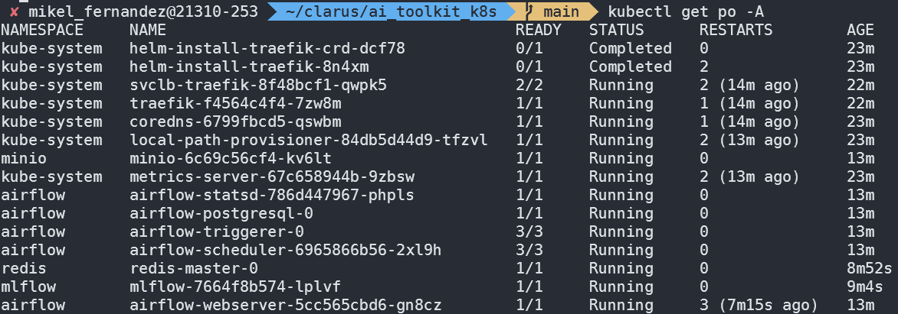
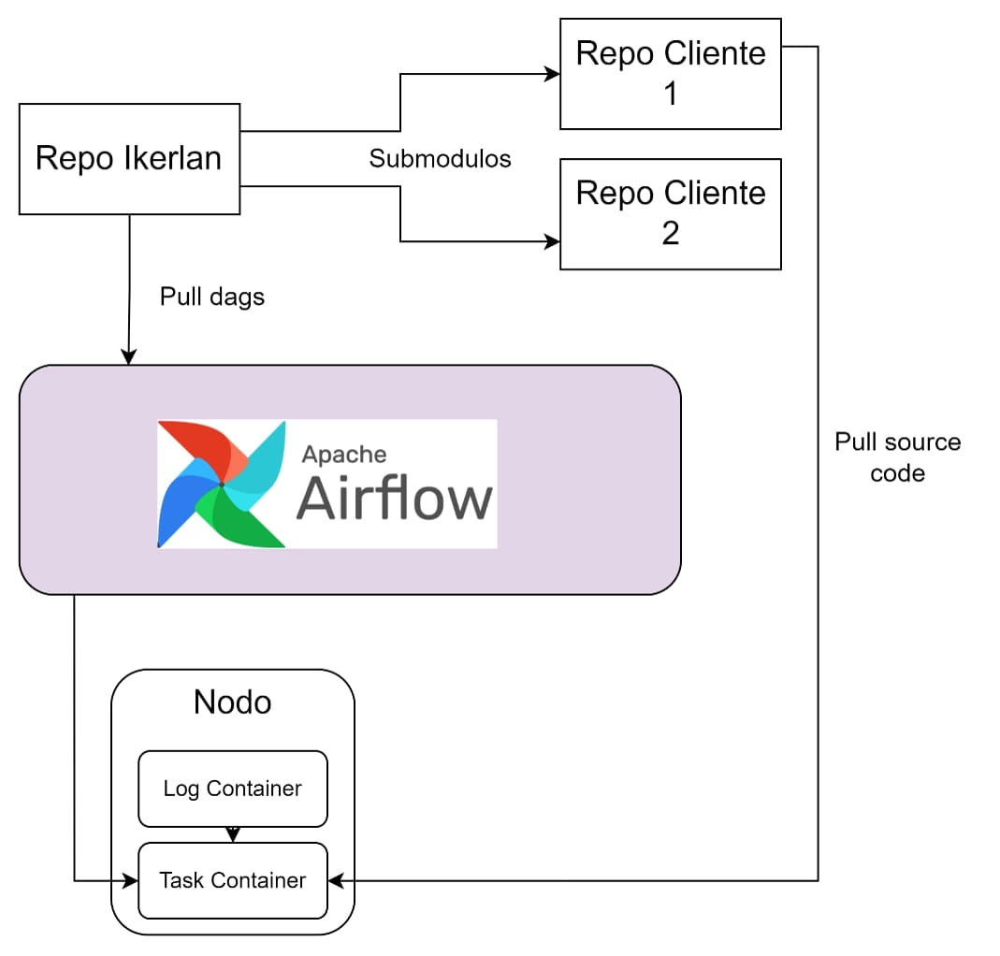

# AI TOOLKIT

## Table of Contents

- [AI TOOLKIT](#ai-toolkit)
  - [Table of Contents](#table-of-contents)
  - [MLOps structure](#mlops-structure)
  - [Deployment](#deployment)
    - [Create the cluster](#create-the-cluster)
      - [Create the main node:](#create-the-main-node)
      - [Create the agent nodes:](#create-the-agent-nodes)
    - [Deploy the platform](#deploy-the-platform)
  - [Services](#services)
  - [Access to services](#access-to-services)
  - [Load DAGs](#load-dags)
    - [Submodules](#submodules)
  - [Container execution](#container-execution)
  - [Reset](#reset)

## MLOps structure

This repository contains everything you need to deploy an MLops platform on top of Kubernetes. 

This architecture is designed to separate the toolkit from the implementation of code and DAGs, to achieve this the toolkit is able to synchronise with a remote repository and load the DAGs. In this section you will find further details: [Load DAGs](#load-dags).

In addition, thanks to the task execution on top of Kubernetes, you can customize almost everything related to the task, this includes for example selecting on which image to execute the task. More info in the [Container execution](#container-execution) section.

This toolkit installs a kubernetes master node using the k3s distribution, in addition, it deploys the following services:

- Airflow
- Postgres
- Minio
- Mlflow
- Redis

The installation of each of the services is done using `helm`, this tool manages application packages for Kubernetes. That said, the structure of the repository is divided into different folders, each of these has what is needed to build a specific service.

There is an `.env` file that defines different variables, these are used to modify the default values of helm packages, with this you can modify credentials, replicas, or endpoints of different services among other things.

```
├── airflow
│   ├── create_db_job.yaml
│   ├── postgres_service.yaml
│   ├── set_up_airflow.sh
│   └── values.yaml
├── minio
│   ├── create_bucket_job.yaml
│   ├── service.yaml
│   ├── set_up_minio.sh
│   └── values.yaml
├── mlflow
│   ├── service.yaml
│   ├── set_up_mlflow.sh
│   └── values.yaml
├── redis
│   ├── set_up_redis.sh
│   └── values.yaml
├── images
│   ├── deployment.png
│   └── RepoDiagram.
├── .env
├── readme.md
├── troubleshooting.md
├── reset.sh
├── delete_mlops.sh
└── set_up.sh
```

With the default values, at the end of the installation you should be able to run a test DAG using all the services of the architecture.

## Deployment

The repository has a script called `set_up.sh` this script does the following:

1. Check that kubernetes is installed, if not it will install a master node using k3s as kubernetes distribution.
2. Loads the values of the variables found in the file `.env`.
3. Run the individual installation scripts found in each folder, these scripts follow the following name format: `set_up_<service>.sh`.

This new script takes care of the following:

1. Replace in the file `values.yaml` the variables by their respective values and save the result in another file called `values_with_env.yaml`.
2. Using helm, install repository using `values_with_env.yaml` file as configuration
3. If required, jobs and services are used, depending on the service.

### Create the cluster

**This step is optional!!**

This platform is complex, it uses a lot of containers, so it can give problems when running on a machine with few resources. To solve this before running the script you can configure the cluster with multiple nodes.

#### Create the main node:

```bash
curl -sfL https://get.k3s.io | INSTALL_K3S_EXEC="server" sh -s - --write-kubeconfig-mode=644
```
#### Create the agent nodes:

After installation it is also possible to add more nodes.

To get the token you have to run this on the server node:

```bash
sudo cat /var/lib/rancher/k3s/server/token
```

Then, on the agent machine:

```bash
curl -sfL https://get.k3s.io | INSTALL_K3S_EXEC="agent --server https://<MASTER_NODE_IP>:6443 --token <TOKEN>" sh -s -
```

### Deploy the platform

The first thing to do is to define the variables in the `.env` file, with the predefined configuration it should load a working demo, to load other DAGs go to the section [Load DAGs](#load-dags).

The demo uses IDS so in the .env **it is necessary to specify these variables**:

    * CONNECTOR_EDGE_IP
    * CONNECTOR_CLOUD_IP

 Then you just need to run this script and the installation will be done:

```bash
./set_up.sh
```

After finishing the execution run this:

```bash
kubectl get po -A
```

The result should be similar to this:



It doesn't matter if there have been many restarts, it is usual in this kind of deployments, the important thing is that all pods that are not in the `kube-system` namespace have to be **`READY`**.

**If multiple pods are giving errors it is most likely that the machine where it is being deployed does not have enough resources, the best thing to do is to reset and add an extra node before installation.**

**If you want to add more nodes, follow the steps seen in the section [Create the cluster](#create-the-cluster)**.

## Services

1. **Airflow:** An open-source platform to programmatically author, schedule, and monitor workflows. Uses DAGs (Directed Acyclic Graphs) to create tasks related to data processing, training, deployment and register of models.

2. **MLflow:** An open-source platform for managing the end-to-end machine learning lifecycle. It tracks experiments, stores model artifacts, and provides a user interface for monitoring and managing models. The installation files are in the `mlflow` folder.

3. **PostgreSQL:** A relational database used for storing MLflow data and other application data. Multiple databases are configured for different services. This service is launched together with airflow, so the configuration is done in the `airflow` folder.

4. **MinIO:** An object storage server compatible with Amazon S3. It is used to store MLflow artifacts, data and Airflow logs. The installation files are in the `minio` folder.

5. **Redis:** Redis is an open source, high-performance in-memory data storage system. It is used to exchange variables between airflow tasks. The installation files are in the `redis` folder.

## Access to services

    * MLflow UI: `http://<Server_IP_or_localhost>:30005`
    * PostgreSQL: `http://<Server_IP_or_localhost>:30006`
    * Airflow UI: `http://<Server_IP_or_localhost>:30007`
    * MINIO API: `http://<Server_IP_or_localhost>:30010`
    * MINIO UI: `http://<Server_IP_or_localhost>:30011`

If you are testing the architecture over `WSL`, you may not have connectivity to the service using `localhost`, use this command to get the correct ip:

```bash
ip addr show eth0 | grep -oP '(?<=inet\s)\d+(\.\d+){3}'
```


## Load DAGs

In this version of the toolkit an extra component is used to synchronise an airflow directory with a git repository, this allows you to load DAGs from a remote repository. The repository address can be defined in the `.env` file `(AIRFLOW_GIT_SYNC_REPO)`.

In case the repository is private, the easiest way is to generate a token at project level and specify the address in this way:

- https://\<repo_owner\>:\<token\>@github.com/owner/repo.git --> in case you are using github
- https://\<repo_name\>:\<token\>@gitlab.com/owner/repo.git --> in case you are using gitlab

The token can have any scope (repository or user level). The important thing is that it has to have cloning permissions. More information on how to generate these tokens in the [ai-toolkit-dag](https://github.com/CLARUS-Project/ai-toolkit-dags) repository.

### Submodules

There is one drawback to this system, **Airflow can only synchronise with one repository**. To be able to use multiple repositories it is necessary to use **submodules**.

The idea is to have a central repository that only has submodules that reference other repositories. Arflow by synchronising with this central repository will be able to clone the submodules in the same way.

To create a **submodule**, you can clone the submodule repository inside the central repository:

```bash
cd <central_repo_directory>
git clone <submodule_repo>
```

**IMPORTANT!!**

Submodules are still references to a specific commit in the repository, if changes are made to the submodules it is necessary to synchronise these changes in the central repository. Otherwise, airflow will be unable to display the changes.

Let's say we have the central repository locally:

```bash
cd <central_repo>
cd <submodule_folder>
git pull origin <branch> # this will update the submodule to latest comit
cd ..
git add .
git commit -m "sync submodule"
git push origin <branch>
```

The resulting scheme is similar to this one:



Airflow will be able to detect the DAGs that are in the submodules, these dag will be in charge of specifying all the tasks, each of these can be executed in any of the nodes of the cluster. 

Tasks may use functions found in other Python files in the same repository. **By default Airflow only clones the DAG** so in order to use these files you have to define in the DAG the repository and branch to clone.

***In this repository you can visualise the structure that the repository and dag must follow in order for airflow to be able to interpret it correctly: [ai-toolkit-dag](https://github.com/CLARUS-Project/ai-toolkit-dags)***

## Container execution

One of the advantages of using Kubernetes is running tasks in containers, now you can specify a docker image and run the task on a container that mounts this image. This way the tasks are no longer bound to run on the same version of python as Airflow.

The definition of the image to be used can be found in the DAG itself. Each of the tasks can use a different image. At the moment this is **limited to using images from public repositories**.

If the cluster where the toolkit has been implemented has more nodes, when you want to run tasks in parallel you get a real parallelisation, because the containers run on independent physical machines.

Related to this, in the future we are looking to implement the possibility of selecting from the DAG in which device to execute each of the tasks, being able to select the node using its name or select a node that meets some resource criteria.

## Reset

The repository includes two scripts, `reset.sh` and `delete_mlops.sh`. 

- `reset.sh`: Will erase all traces of the installation, this includes uninstalling the kubernetes cluster (if k3s is used as a distribution only). 
- `delete_mlops.sh`: Will delete all instances of the platform, **including volumes**.